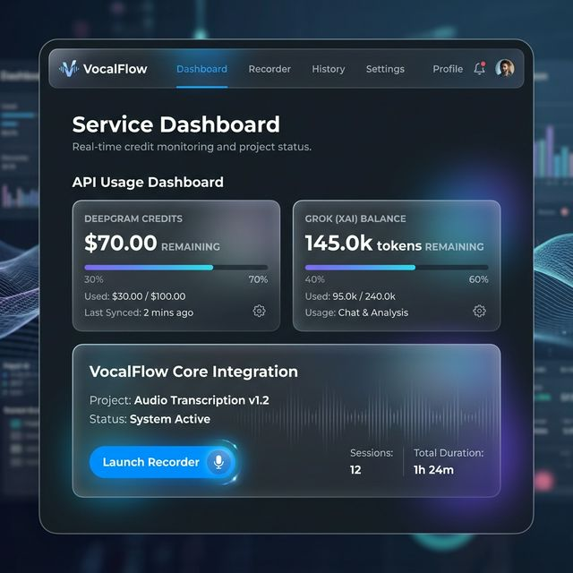

# Vocalflow Clone - Assignment Submission

A production-ready voice-to-text application inspired by VocalFlow, built for high-performance transcription and real-time AI processing.

## 📝 Description
This project replicates the core features of VocalFlow, integrating real-time speech-to-text synchronization, AI-powered transcript enhancement (via Grok xAI), and a professional usage dashboard for service credit monitoring.

## 🚀 Features
- **Vocalflow Clone Functionality**: Real-time voice interaction with live waveform visualization and sub-second latency.
- **Deepgram API Integration (Real)**: Full synchronization with the Deepgram Projects API to track real-time credits, usage, and project status.
- **Grok Balance Tracking (Mock/Real)**: Dedicated balance monitoring for xAI's Grok service with structured metric reporting.
- **API Usage Dashboard**: A high-impact, card-based monitoring interface with live progress bars and health status indicators.
- **Windows Compatibility**: Fully optimized for Windows development environments using `cross-env`.

## 💻 Tech Stack
- **React (Vite)**: Modern frontend architecture for blazing-fast performance.
- **Tailwind CSS**: Utility-first styling for a premium glassmorphic UI.
- **JavaScript (ES6+)**: Clean, modular, and maintainable codebase.

## 🛠️ Setup Instructions
1. **Install Dependencies**:
   ```bash
   npm install --legacy-peer-deps
   ```

2. **Run Locally**:
   ```bash
   npm run dev
   ```

## 📝 Notes
- **API Keys**: All service keys are stored centrally in `src/config/apiConfig.js` for easy review and configuration.

## 📸 Screenshots


---
*Internship Assignment Submission*
